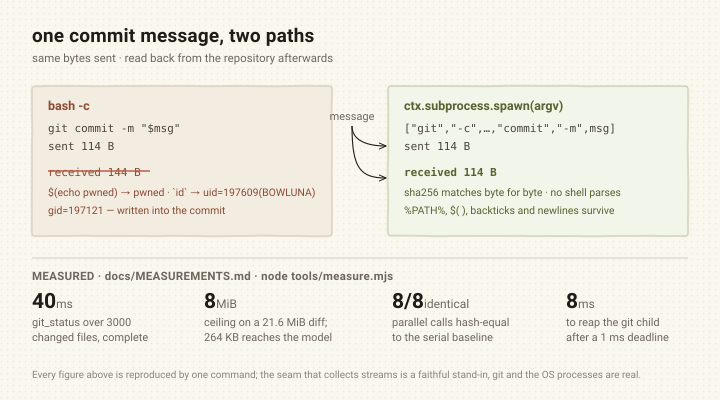

# dsh-zcode-git

English | [中文](README.zh.md)

[](https://github.com/BOWLUNA/dsh-zcode-git/actions/workflows/test.yml)
[](LICENSE)
[](#requirements)
[](#requirements)

Six structured Git tools for [DeepSeek Harness](https://github.com/deepseek-ai)
agents: status, diff, log, branch, commit and stash — with the output pinned, no
shell in the path, and every write behind the harness approval service.

The harness ships no git tooling, so an agent drives `bash`. This replaces that.

```bash
dsh plugin --profile web add dsh-zcode-git
```



## How it compares with ZCode

[ZCode](https://github.com/zai-org/ZCode) is where this plugin's approach comes
from, and its git layer is well ahead of most. The table is written to be
checkable: every ZCode claim names a file and line, every "adds" claim names
something you can run, and **where this plugin has not caught up the row says so
rather than being left out**.

| What ZCode has | What this plugin took | What this plugin adds (**better**, where it is) | Evidence |
| --- | --- | --- | --- |
| `workflow-git-world-read.ts:12` (the heading) and `:14` — "只读是**构造**出来的，不是检查出来的": only five read-only subcommands can be built, and no path can produce a shell string | The same premise: every git call goes through `ctx.subprocess.spawn` with an argv array, so no shell sees an argument | **The write half, behind an approval gate.** ZCode's `git.*` has no write path by construction; this plugin adds commit / stash / branch mutations, and `ctx.approval` is **fail-closed** — with no approval service mounted the mutation is refused, not allowed | `node tools/verify-comparison.mjs` → row 1 · `test/exec.test.js` · `node tools/measure.mjs --only argv` |
| `workflow-git-world-read.ts:80` — `GIT_REF_PATTERN`, and `:72` — "首字符不许是 `-` 是这条规则里唯一**安全相关**的部分" | The same rule: `validateRevision` rejects a revision starting with `-` | Extended to branch names, commit messages and paths — and the row is precise about **why the dash rule is needed only on revisions**: every user-supplied name travels after `--`, so `git branch -- -b` is a name, not an option. ZCode reaches the same end by construction too | `node tools/verify-comparison.mjs` → row 2 (includes the `--` placement assertion) · `test/validate.test.js` |
| `workflow-git-world-read.ts:22` — the `-z` contract, recording `core.quotePath` and newline-in-filename; `:98` — the `-z` element of `GIT_STATUS_ARGV`; `:26` — "我们自己的 `git log` 也已经用 `%x00` 分隔字段" | The same `-z`, extended to `status` and `stash list` | The field separator is **different, and mine is the weaker choice**: this plugin uses `%x1f`, ZCode uses `%x00`. NUL cannot occur in a git object at all, so **on this row this plugin has not overtaken ZCode** | `node tools/verify-comparison.mjs` → row 3 |
| `git-snapshot.ts:127` — `execFile(GIT_COMMAND, args, {cwd, maxBuffer, timeout})`: an argv array, but **no `-c` overrides and no `env`** | The argv array | **Ten pinned `git -c` overrides** (`color.ui`, `core.pager`, `core.quotepath`, `diff.external`, `status.relativePaths`, `log.showSignature`, `log.date`, `diff.noprefix`, `diff.mnemonicPrefix`, `advice.detachedHead`), so the user's configuration cannot reshape what the model reads. ZCode instead lists `git -c` in `GIT_GLOBAL_DANGEROUS_FLAGS` for its *bash* channel — reasonable there, since in a shell the flag is attacker-supplied; here it is constructed by us and never reaches a shell | `node tools/verify-comparison.mjs` → row 4 (asserts all ten reach git, by name) |
| `workflow-git-world-read.ts:28` — **one path base**: repo-root-relative on the wire, prefix stripped via `rev-parse --show-prefix`; `:36` — "工作区就是仓库根时三者恰好相同，所以它会一直不被发现" | — | **Not overtaken.** This plugin does not do this layer at all: with the session `cwd` inside a subdirectory it hands back repo-root-relative paths, and feeding them straight back returns `ok: true, files: [], message: ""` — silently nothing. Filed as a defect | `node tools/verify-comparison.mjs` → row 5 (asserts the gap still reproduces — **this check goes red the day it is fixed**, which is the point) · `node tools/_probe-pathbase.mjs` |
| `git-snapshot.ts:168` — `git status` is truncated at **2k characters**, not by entry count, to keep the provider-visible prompt shape stable | The same concern: keep the output bounded | **Bounded by items and lines, with the truncation reported rather than silent**: `maxDiffLines` / `maxLogEntries` / `clampInteger`, and `truncated: true` plus a spill path when the seam overflows (measured: a 21.6 MiB diff reaches the model as 264 KB) | `node tools/verify-comparison.mjs` → row 6 · `node tools/measure.mjs --only spill` · `test/validate.test.js` |

### Reproducing the comparison

Every row above reduces to a command. Nothing in the table needs to be taken on
trust:

```bash
git clone https://github.com/BOWLUNA/dsh-zcode-git && cd dsh-zcode-git
npm install                       # links the harness peers; the plugin has no runtime deps
node tools/verify-comparison.mjs  # the table, row by row — exits non-zero if a row overstates
node test/run.mjs                 # 95 checks
node tools/measure.mjs            # the numbers behind the diagram, in about 18 seconds
```

Row 5 is reported as `GAP REPRODUCES` rather than `PASS`: it is a defect, not a
claim of superiority, and the check asserts the defect is *still there* so the
README cannot quietly keep claiming it after a fix.

## What it does about `bash`

| Problem with `bash` | What this plugin does |
| --- | --- |
| Output shape follows the user's config (`color.ui`, `core.pager`, `core.quotepath`, `diff.external`, `status.relativePaths`, aliases) | Pins every one of those settings per invocation and parses porcelain / NUL / `%x1f` formats |
| `git commit -m "..."` must survive cmd.exe, PowerShell, and POSIX sh — each with different escaping, and none of them preserving `%PATH%`, `$(...)`, or a newline by accident | Builds an **argv array**: no shell ever sees an argument |
| In `bash`, `git status` and `git push --force` are equally privileged | Splits reading from mutating, and routes mutations through the harness approval service |

## Requirements

- DeepSeek Harness `>=0.1.5-rc.2 <0.1.6-0 || >=0.1.6-alpha.1 <0.2.0-0` — the same range is declared in `engines.dsh`
- Node `>=20`, which the harness's own bundled runtime satisfies
- A `git` binary on `PATH`

## Install

```bash
dsh plugin --profile web add dsh-zcode-git
```

The bundle declares its own patch, so the profile's `bundles` list is updated
automatically. Restart Harness afterwards — bundle-layer changes are read at
boot.

To mount it by hand instead:

```yaml
# cordis.patch.yml
- insert:
    - id: tool-git
      name: dsh-zcode-git
```

## Tools

| Tool | Kind | What it does |
| --- | --- | --- |
| `git_status` | read | Branch, upstream, ahead/behind, and the staged / modified / conflicted / untracked / ignored lists |
| `git_diff` | read | Per-file line counts plus the unified diff, scoped by `paths`, `staged`, or `contextLines` |
| `git_log` | read | Commits as `{hash, shortHash, author, date, subject}`, bounded by `limit`, narrowable by `paths` or `revision` |
| `git_branch` | read + write | `list` / `create` / `switch` / `delete`; mutations are approved |
| `git_commit` | write | Optionally stages `paths`, then commits `message`; approved |
| `git_stash` | read + write | `list` / `push` / `pop` / `apply` / `drop`; mutations are approved |

Every tool takes an optional `path` selecting the repository; it defaults to
the session working directory, and a relative value resolves against it.

### Status codes

`git_status` renders git's own two-column code — index state, then worktree
state — so `.M` is an unstaged edit and `M.` is a staged one. The words are
also returned as fields (`index`, `worktree`) for callers that prefer them.

## Safety

**No shell, ever.** Every invocation goes through `ctx.subprocess.spawn` with
an `argv` array. The harness's other seam, `ctx.shell`, takes a single command
line; using it would push every argument back through a shell parser. There is
no escaping routine that is correct for cmd.exe, PowerShell, and POSIX sh at
once — cmd.exe still expands `%VAR%` inside double quotes — so the argument
never reaches a shell in the first place. A commit message containing `"`,
`` ` ``, `$(...)`, `%PATH%`, a newline, or CJK text is stored byte-for-byte.

**Output is pinned.** These are forced on every call, immediately after `git`,
because each one changes the bytes this plugin parses:

```
color.ui=false              core.pager=cat
core.quotepath=false        status.relativePaths=false
log.showSignature=false     log.date=default
diff.noprefix=false         diff.mnemonicPrefix=false
diff.external=              advice.detachedHead=false
```

Behavioural settings are deliberately **not** pinned: `user.name`,
`user.email`, `core.autocrlf`, hooks, and `core.sshCommand` are the user's
intent, not noise. The child environment adds `GIT_TERMINAL_PROMPT=0` so a
credential-needing operation fails immediately instead of blocking on a prompt
nobody can answer, and `GIT_OPTIONAL_LOCKS=0` so a read cannot fail because
another window holds `index.lock`.

**Mutations are approved.** `git_commit`, and the mutating actions of
`git_branch` and `git_stash`, call `ctx.approval.request()` before running. If
no approval service is mounted the mutation is **refused**, not allowed — a
silently unguarded `git commit` is the outcome this plugin exists to prevent.
Set `requireApprovalForWrites: false` only if you are knowingly accepting that.

**Paths are validated.** Absolute paths, `..` traversal, UNC paths,
drive-relative forms (`C:foo`), NTFS alternate data streams, Windows reserved
device names, and control characters are all rejected before any process
starts. git would refuse most of these anyway; checking first produces a
precise message and keeps hostile input away from a process entirely.

**Not provided — on purpose.** `push`, `fetch`, `pull`, `reset`, `clean`,
`rebase`, `remote`, and config writes. In `bash` these are at least visible in
a command line a human can read; as a tool they become a one-call destroyer
guarded only by a prompt. Fetch and push need credential and host-key handling
that deserves its own design, not a checkbox here.

## Configuration

| Key | Default | Meaning |
| --- | --- | --- |
| `timeoutMs` | `30000` | Per-invocation timeout |
| `maxDiffLines` | `500` | Default patch line ceiling (clamped to 10–5000) |
| `maxLogEntries` | `50` | Default `git_log` limit (clamped to 1–500) |
| `requireApprovalForWrites` | `true` | Whether mutations need an approval decision |

A patch entry **replaces** the whole `config` map rather than merging into it,
so restate anything you want to keep:

```yaml
- insert:
    - id: tool-git
      name: dsh-zcode-git
      config:
        timeoutMs: 60000
        requireApprovalForWrites: true
```

## Development

```bash
npm test          # node --test
```

95 tests, no dependencies beyond the harness peers. They split into six
layers:

- `test/parse.test.js` — the pure parsers, against recorded git output
- `test/validate.test.js` — path, message, ref-name, and revision validation
- `test/exec.test.js` — the spawn spec, against a recording fake
- `test/tools.test.js` — tool behaviour, against a fake subprocess service
- `test/e2e.test.js` — a real `git` binary against real temporary repositories
- `test/schema.test.js` — schema compatibility with the harness and providers

## Notes for plugin authors

Three things in this plugin exist because the obvious approach fails, and none
of them fail loudly at the point of the mistake. They are worth knowing before
writing another tool plugin.

**`ctx.tools.register()` does not compile anything.** It validates
`output.schema`, then stores the definition verbatim. The `parameters` authoring
DSL is *not* converted — so registering a raw definition object sends a bare
property map with no top-level `type` to the model provider, which rejects the
entire request. Wrap it: `ctx.tools.register(defineTool(definition))`. The
provider names only the alphabetically first tool, so the error points at a
tool that is not at fault.

**`parameters` and `output.schema` use different DSLs.** `parameters` is a flat
property map (`{ path: { type: "string" } }`); `output.schema` is raw JSON
Schema (`{ type: "object", properties: { ... } }`). Passing the JSON Schema form
to `parameters` throws `parameters.type must be a value schema object`; passing
the flat map to `output.schema` throws `schema.type must be string/…`.

**Schema keywords are version-sensitive.** `required: true` inside a property
is accepted by dsh-tools `0.1.5-rc.2` and rejected by `0.1.6-alpha.2`
(`UNSUPPORTED_SCHEMA`). A top-level `required: [...]` array is rejected by both.
`enum` in a tool schema caused a provider to reject the whole function schema
with `must be a JSON Schema of 'type: "object"', got 'type: null'`. This plugin
therefore declares none of them and enforces the same constraints in code,
which also produces better messages — `unsupported action "x"; expected one of
list, create, switch, delete`.

**The returned value must match the schema exactly.** A `null` where the schema
says `string` fails the turn with `INVALID_TOOL_OUTPUT` *after* git has already
succeeded. Omit the field instead of sending `null`.

**Renderers run after the work is done.** A renderer that reads a field its
`execute` never returned throws inside the harness and fails an otherwise
successful turn. `test/tools.test.js` drives every tool's output through its
own renderer for this reason.

## Licence

MIT
